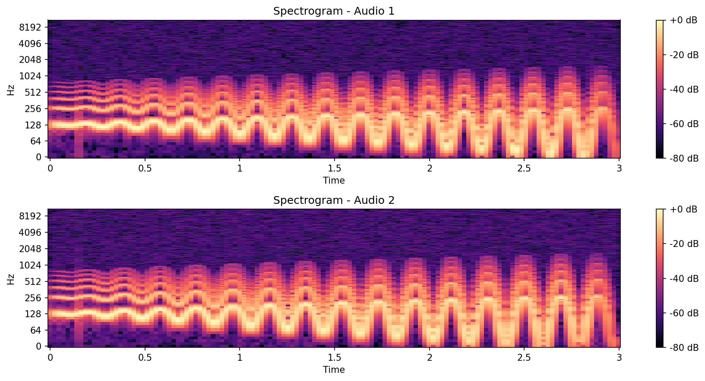

# Voice Similarity Checker

Audio biometrics tool that determines whether two voice recordings belong to the same person, using **MFCC cosine distance** and spectral feature analysis.

[](https://colab.research.google.com/github/DaniAngel79/voice-similarity-checker/blob/main/voice_similarity_checker.ipynb)
[](https://huggingface.co/spaces/DaniAngel79/voice-similarity-checker)


---

## Live demo

### Option 1 — Google Colab (no install needed)
Click **Open in Colab** above → Run all cells → The last cell launches a public Gradio link automatically.

### Option 2 — HuggingFace Space (runs in browser, zero setup)
Click the **HuggingFace** badge above → Upload two audio files → Get result instantly.

---

## Demo


---

## Sample output — Spectrogram



---

## How it works

1. Load two audio files (WAV or MP3) via `librosa`
2. Extract **13 MFCC coefficients** per audio (mean over time)
3. Compute **cosine distance** between MFCC vectors — the primary similarity metric
4. Also extract spectral features: centroid, flatness, rolloff
5. **Verdict:** MFCC cosine distance < 0.15 → same person
6. Save spectrogram image (`spectrogram_output.png`) + PDF report (`similarity_report.pdf`)

## Technical stack

| Component | Library | Detail |
|-----------|---------|--------|
| Audio loading | `librosa` | WAV and MP3 support |
| Feature extraction | `librosa.feature.mfcc` | 13 MFCC coefficients, mean over time |
| Similarity metric | NumPy | Cosine distance: `1 − (v1·v2 / ‖v1‖‖v2‖)` |
| Spectral features | `librosa.feature` | centroid, flatness, rolloff |
| Interactive UI | `gradio` | Local + public share link |
| PDF report | `fpdf2` | Auto-generated metrics report |

## Similarity threshold

| MFCC Cosine Distance | Interpretation |
|----------------------|----------------|
| < 0.15 | Same person |
| ≥ 0.15 | Different persons |

Threshold calibrated empirically. Adjust in `determine_similarity()` for your use case.

---

## Local setup
```bash
git clone git@github.com:DaniAngel79/voice-similarity-checker.git
cd voice-similarity-checker
pip install -r requirements.txt
jupyter notebook voice_similarity_checker.ipynb
```

Run all cells in order. The last cell launches Gradio at `http://localhost:7860`.

## Project structure
```
voice-similarity-checker/
├── voice_similarity_checker.ipynb  # Main notebook
├── audio_path_1.wav                # Sample audio 1 (demo)
├── audio_path_2.wav                # Sample audio 2 (demo)
├── spectrogram_output.png          # Sample spectrogram output
├── similarity_report.pdf           # Sample PDF report
├── demo_biometria.gif.webm         # Demo recording of the Gradio UI
├── requirements.txt
├── .gitignore
└── README.md
```

> The sample WAV files are short voice recordings included exclusively for testing purposes.
